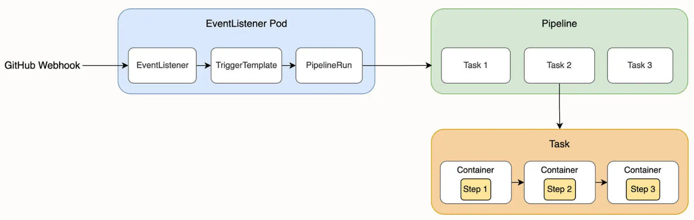
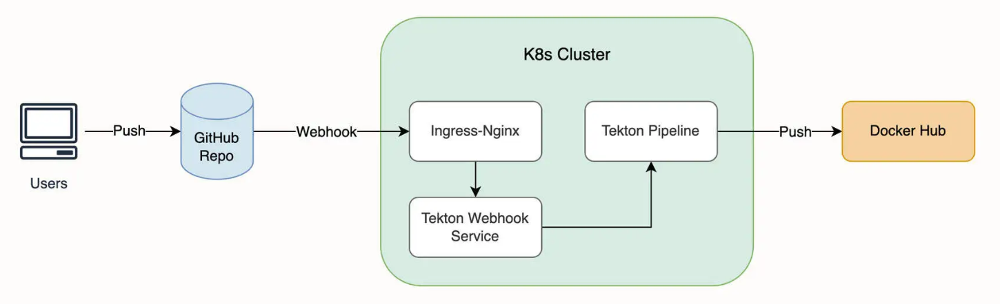

# 1 组件安装

## 1.1 Tekton

### 首先安装operator

```bash

$ kubectl apply -f https://storage.googleapis.com/tekton-releases/pipeline/latest/release.yaml
namespace/tekton-pipelines created
podsecuritypolicy.policy/tekton-pipelines created
......
```
等待Tekton所有pod就绪
```bash

$ kubectl wait --for=condition=Ready pods --all -n tekton-pipelines --timeout=300s
pod/tekton-pipelines-controller-799f9f989b-hxmlx condition met
pod/tekton-pipelines-webhook-556f9f7476-sgx2n condition met
```
因为grc.io不能访问，所以需要修改镜像，使用代理的方式：即将`gcr.io`改为`gcr.dockerproxy.com`。通过`kubectl edit`完成。

后面可能需要将容器启动参数args中指定的镜像名称修改一下。

### 安装Tekton dashboard

```bash

$ kubectl apply -f https://storage.googleapis.com/tekton-releases/dashboard/latest/release.yaml
serviceaccount/tekton-dashboard created
role.rbac.authorization.k8s.io/tekton-dashboard-info created
......
```

### 安装Tekton trigger和Tekton interceptors组件
```bash

$ kubectl apply -f https://storage.googleapis.com/tekton-releases/triggers/latest/release.yaml
podsecuritypolicy.policy/tekton-triggers created
clusterrole.rbac.authorization.k8s.io/tekton-triggers-admin created
......

$ kubectl apply -f https://storage.googleapis.com/tekton-releases/triggers/latest/interceptors.yaml
deployment.apps/tekton-triggers-core-interceptors created
service/tekton-triggers-core-interceptors created
......
```
所有Tekton的所有组件的pod都ready之后，Tekton就部署完成了。

# 2 暴露Tekton dashboard
Tekton dashboard的暴露使用ingress的方式。
## 2.1 安装ingress-nginx

```bash

$ kubectl apply -f https://ghproxy.com/https://raw.githubusercontent.com/kubernetes/ingress-nginx/controller-v1.4.0/deploy/static/provider/cloud/deploy.yaml
namespace/ingress-nginx created
serviceaccount/ingress-nginx created
serviceaccount/ingress-nginx-admission created
......
```
等待pod就绪
```bash
$ kubectl wait --for=condition=AVAILABLE deployment/ingress-nginx-controller --all -n ingress-nginx
deployment.apps/ingress-nginx-controller condition met
```
## 2.2 暴露dashboard
将以下内容保存为tekton-dashboard.yaml
```yalm

apiVersion: networking.k8s.io/v1
kind: Ingress
metadata:
  name: ingress-resource
  namespace: tekton-pipelines
  annotations:
    kubernetes.io/ingress.class: nginx
    nginx.ingress.kubernetes.io/ssl-redirect: "false"
spec:
  rules:
    - host: tekton.k8s.local
      http:
        paths:
          - path: /
            pathType: Prefix
            backend:
              service:
                name: tekton-dashboard
                port:
                  number: 9097
```
创建ingress
```bash
$ kubectl apply -f tekton-dashboard.yaml
ingress.networking.k8s.io/ingress-resource created
```
最后配置hosts文件后就可以通过域名访问了

### 配置basic auth
#### 创建htpasswd文件
```bash
$ htpasswd -c auth foo
New password: <bar>
New password:
Re-type new password:
Adding password for user foo
```
#### 转换htpasswd为secret
```bash
$ kubectl create secret generic basic-auth --from-file=auth
secret "basic-auth" created
```
#### 检查secret
```bash
$ kubectl get secret basic-auth -o yaml
apiVersion: v1
data:
  auth: Zm9vOiRhcHIxJE9GRzNYeWJwJGNrTDBGSERBa29YWUlsSDkuY3lzVDAK
kind: Secret
metadata:
  name: basic-auth
  namespace: default
type: Opaque
```
#### 创建使用basic auth的ingress
```bash
$ echo "
apiVersion: networking.k8s.io/v1
kind: Ingress
metadata:
  name: ingress-with-auth
  annotations:
    # type of authentication
    nginx.ingress.kubernetes.io/auth-type: basic
    # name of the secret that contains the user/password definitions
    nginx.ingress.kubernetes.io/auth-secret: basic-auth
    # message to display with an appropriate context why the authentication is required
    nginx.ingress.kubernetes.io/auth-realm: 'Authentication Required - foo'
spec:
  ingressClassName: nginx
  rules:
  - host: foo.bar.com
    http:
      paths:
      - path: /
        pathType: Prefix
        backend:
          service: 
            name: http-svc
            port: 
              number: 80
" | kubectl create -f -
```
# 3 Tekton实践
## 3.1 Tekton简介
结合下图理解Tekton的一些概念

上图依次出现了如下几个概念：
- EventListener
- TriggerTemplate
- PipelineRun
- Pipeline
- Task
- Step

### 3.1.1 EventListener
事件监听器，以HTTP方式对外暴露。GitHub创建webhook，调用EventListener，接收仓库的推送事件
### 3.1.2 TriggerTemplate
EventListener收到外部事件后，会调用Trigger创建相应的Tekton的资源，例如PipelineRun。这个资源的模板就是TriggerTemplate定义的
### 3.1.3 Step
流水线中一个具体的操作，如构建和推送镜像操作。Step以运行脚本的镜像以及脚本作为参数，Tekton启动镜像并执行脚本。
### 3.1.4 Task
一组有序的Step集合，每个Task在独立的Pod中运行，Task中的不同Step在同一Pod的不同container中运行
### 3.1.5 Pipeline
Tekton的一个核心组件，是一组Task的集合。Task组成一组有向无环图(DAG)，Pipeline会按DAG的顺序运行。
### 3.1.6 PipelineRun
Pipeline的实例化，负责为Pipeline提供输入参数，并运行Pipeline。如两次构建不同的镜像对应的就是两个不同的PipelineRun资源
## 3.2 创建Tekton Pipeline
这里要创建的Pipeline最终效果如下图所示

向GitHub推送代码时，GitHub以HTTP请求方式通知Tekton的Trigger，Trigger是通过ingress对外暴露的。Trigger收到GitHub的事件推送时，将通过TriggerTemplate创建PipelineRun来运行Pipeline，最终实现镜像的自动构建和推送。
### 3.2.1 牛刀小试
先使用Task和TaskRun创建一个hello world示例。首先创建一个Task，文件名称为`hello-world.yaml`
```yaml
apiVersion: tekton.dev/v1beta1
kind: Task
metadata:
  name: hello
spec:
  steps:
    - name: echo
      image: alpine
      script: |
        #!/bin/sh
        echo "Hello World"
```
将Task应用到集群
```bash
kubectl apply --f hello-world.yaml
```
创建实例化的`TaskRun`对戏，执行上面的Task。定义`hello-world-run.yaml`，内容如下
```yaml
apiVersion: tekton.dev/v1beta1
kind: TaskRun
metadata:
  name: hello-task-run
spec:
  taskRef:
    name: hello
```
应用到集群
```bash
kubectl apply --filename hello-world-run.yaml
```
查看
```bash
kubectl get taskrun hello-task-run
NAME                    SUCCEEDED    REASON       STARTTIME   COMPLETIONTIME
hello-task-run          True         Succeeded    22h         22h
```
查看日志
```bash
kubectl logs --selector=tekton.dev/taskRun=hello-task-run
Hello World
```
为什么上面的`--selector`能选择到执行taskrun的pod呢，原因如下
```bash
kubectl get pod --show-labels
NAME                 READY   STATUS      RESTARTS        AGE   LABELS
hello-task-run-pod   0/1     Completed   0               53m   app.kubernetes.io/managed-by=tekton-pipelines,tekton.dev/task=hello,tekton.dev/taskRun=hello-task-run
```

>NOTE: 要确保部署Tekton时`tekton-pipelines-controller` Deployment中容器中args部分指定的镜像也能正常拉取。要么就需要在运行taskrun的时候指定镜像。taskrun的执行，会创建pod
```bash
kubectl get pod
NAME                 READY   STATUS            RESTARTS        AGE
hello-task-run-pod   0/1     PodInitializing   0               33s
```
taskrun运行成功后pod状态如下
```bash
kubectl get pod
NAME                 READY   STATUS      RESTARTS        AGE
hello-task-run-pod   0/1     Completed   0               2m49s
```

还可以使用`tkn`命令行查看taskrun的日志
```bash
tkn taskrun logs hello-task-run
```

### 3.2.2 创建Task
创建Pipeline之前，先创建两个task
- 检出代码
- 构建和推送镜像

task资源yaml字段结构
```yaml
apiVersion:
kind:
metadata:
spec:
  steps:
```
上面列列举的字段都是必填字段。spec字段下面还可以有如下的可选字段
```yaml
apiVersion:
kind:
metadata:
spec:
  steps: required
  params:
  resources: alpha only
  workspaces:
  results:
  volumes:
  stepTemplate:
  sidecars:
```
具体支持哪些字段参考文档。
例如使用如下清单定义一个task
```bash
cat task-build-app.yaml
# because the repository in git is public, so there is no authenctication required when pulling the code
apiVersion: tekton.dev/v1beta1
kind: Task
metadata:
  name: build-app
spec:
  workspaces:
    - name: source
      description: the git repo will be cloned into the volume that back this workspace. This is the feature that tekton can specify the volume type during task run or pipeline run not now
  params: # the value of params can be set when task run, this is more flexible
    - name: contextDir
      description: the dir contains the source code
      default: quarkus
    - name: tlsVerify
      default: "false"
      type: string
      description: enable tls verify or not
    - name: url
      default: https://github.com/tuxnotes/tekton-tutorial-greeter.git
    - name: revision
      default: master
    - name: subdirectory
      default: ""
    - name: sslVerify
      type: string
      default: "false"
      description: define if http.sslVerify should be set to true or false in the global git config
  steps:
    - image: hub.smartsteps.com/gitops/tektoncd/pipeline/cmd/git-init:v0.43.2
      name: clone
        #resources: {} # the resources field work as resources like in a pod.spec.containers
      script: |
        CHECKOUT_DIR="$(workspaces.source.path)/$(params.subdirectory)"
        cleandir() {
          # Delete any existing contents of the repo directory if it exists.
          #
          # We don't just "rm -rf $CHECKOUT_DIR" because $CHECKOUT_DIR may be "/"
          # or the root of a mounted volume.
          if [[ -d "$CHECKOUT_DIR" ]]; then
            # Delete non-hiden file and directories
            rm -rf "$CHECKOUT_DIR"/*
            # Delete files and directories starting with . but excluding ..
            rm -rf "$CHECKOUT_DIR"/.[!.]*
            # Delete files and directories starting with .. plus any other character
            rm -rf "$CHECKOUT_DIR"/..?*
          fi
        }
        /ko-app/git-init \
          -url "$(params.url)" \
          -revision "$(params.revision)" \
          -path "$CHECKOUT_DIR" \
          -sslVerify="$(params.sslVerify)"
        cd "$CHECKOUT_DIR"
        RESULT_SHAR="$(git rev-parse HEAD)"
    - name: build-sources
      resources:
        limits:
          cpu: 1000m
          memory: 2Gi
        requests:
          cpu: 500m
          memory: 1Gi
      image: hub.smartsteps.com/public/maven:3.8.1-jdk-8
      command:
        - mvn
      args:
        - -DskipTests
        - clean
        - insall
      env:
        - name: user.home
          value: /home/tekton
      workingDir: "/workspaces/source/$(params.contextDir)"
```
在kubernetes中获取task后的yaml，有以下不同
```yaml
computeResources:
      limits:
        cpu: "1"
        memory: 2Gi
      requests:
        cpu: 500m
        memory: 1Gi
```
即`resources`替换为了`computeResources`。但在Tekton的dashboard中显式的依然是`resources`。
对应的taskrun如下
```bash
cat -A taskrun-build-app.yaml
apiVersion: tekton.dev/v1beta1$
kind: TaskRun$
metadata:$
  generateName: build-app-run-$
  labels:$
    app.kubernetes.io/managed-by: tekton-pipelines$
    tekton.dev/task: build-app$
spec:$
  params:$
    - name: contextDir$
      value: quarkus$
    - name: revision$
      value: master$
    - name: sslVerify$
      value: "false"$
    - name: subdirectory$
      value: ""$
    - name: tlsVerify$
      value: "false"$
    - name: url$
      value: https://github.com/gitops-cookbook/tekton-tutorial-greeter.git$
    taskRef:$
      kind: Task$
      name: build-app$
    workspaces:$
    - emptyDir: {}$
      name: source$
```
需要注意的是带有`generateName`字段的yaml文件不能使用`kubectl apply`, 否则会有如下报错。

```
kubectl apply -f taskrun-build-app.yaml
error: from build-app-run-: cannot use generate name with apply
```
上面的yaml文件使用`kubectl create`进行创建
```bash
kubectl create -f taskrun-build-app.yaml
taskrun.tekton.dev/build-app-run-k7hnv created
```


